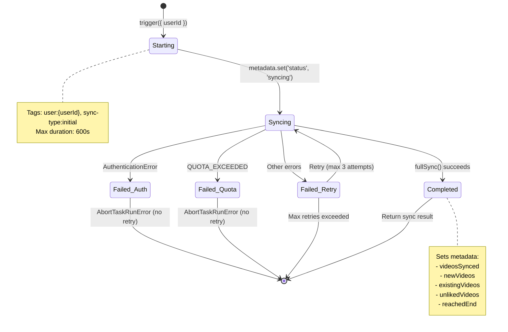
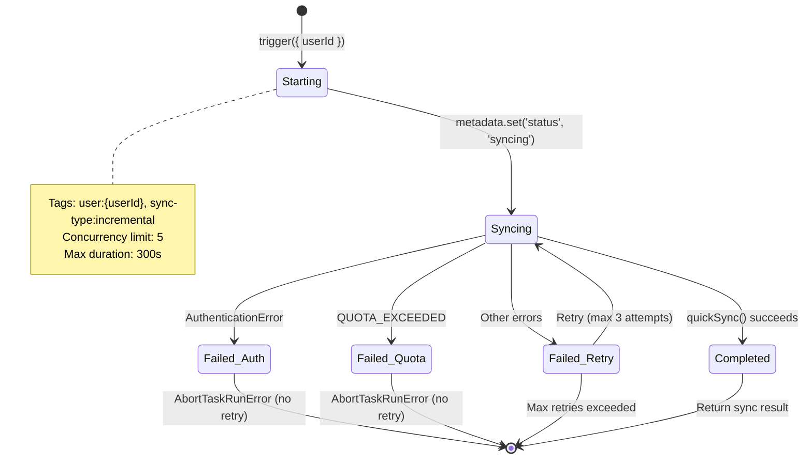
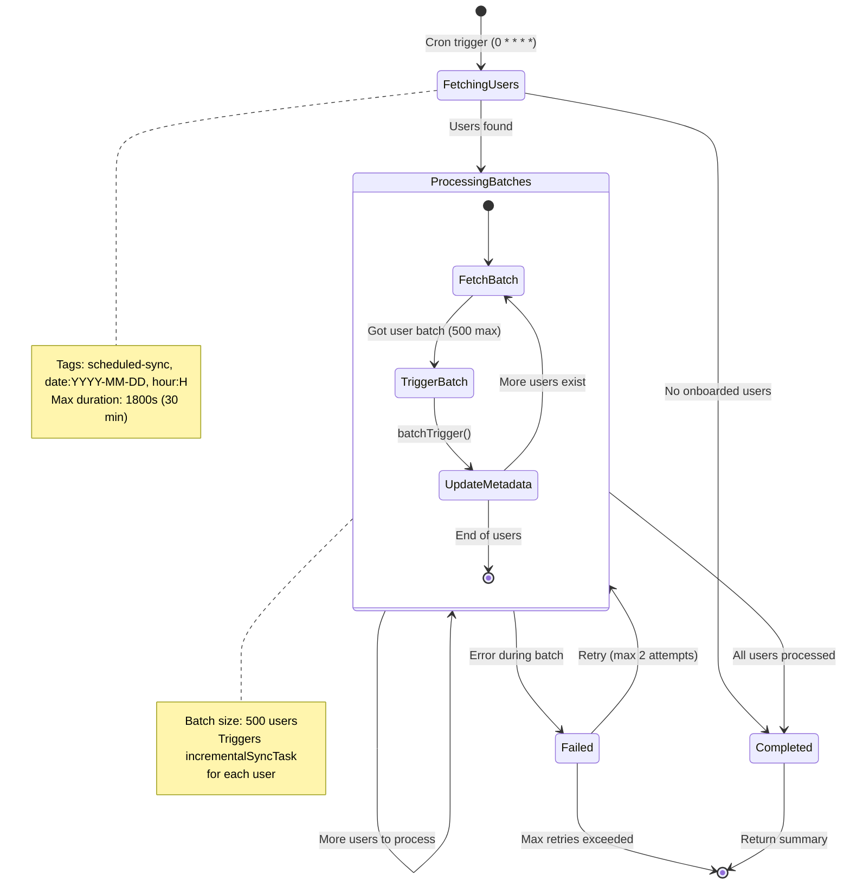
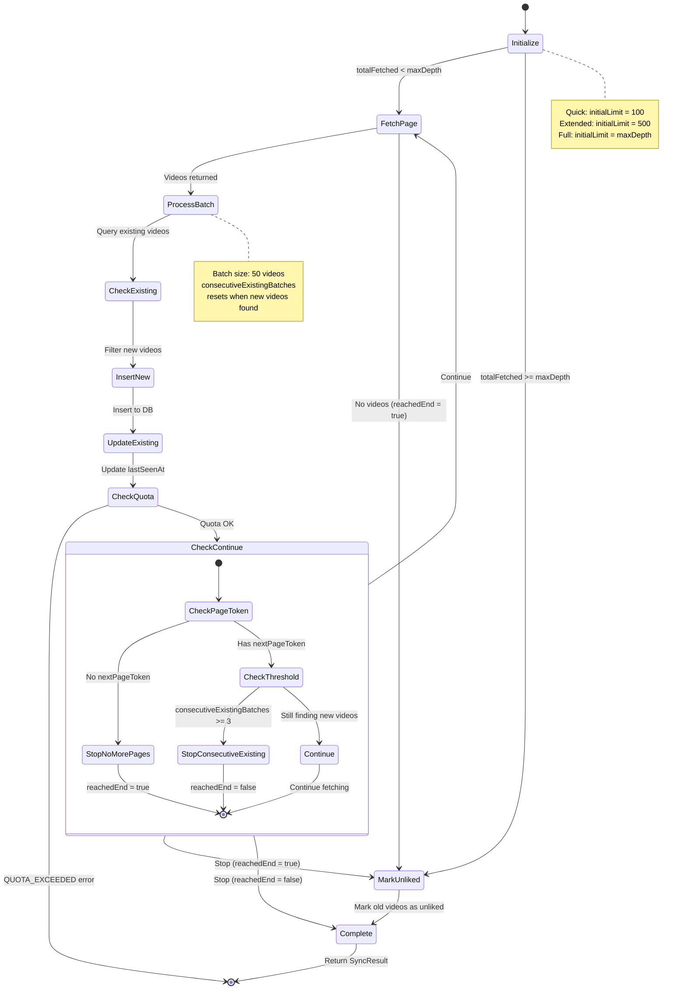
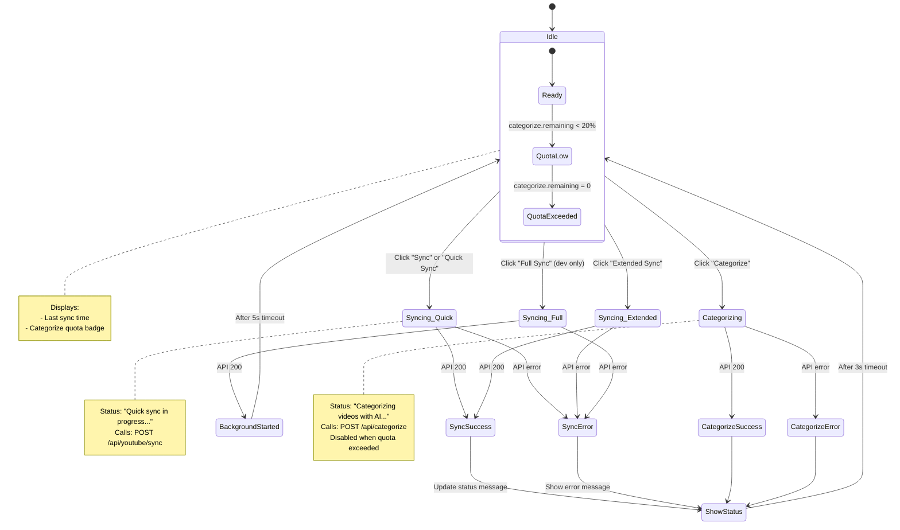
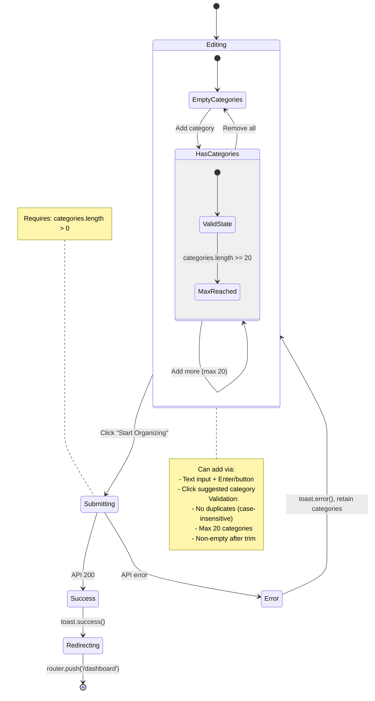
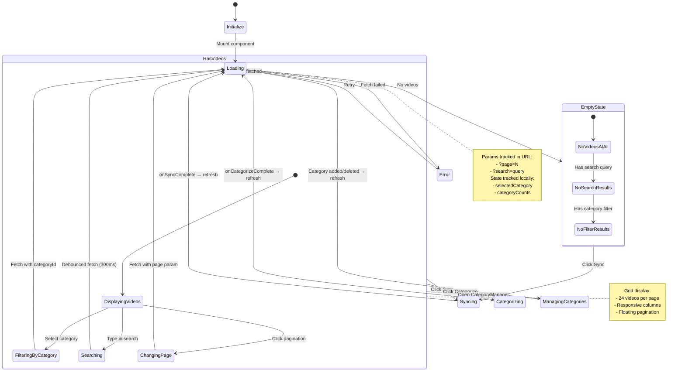
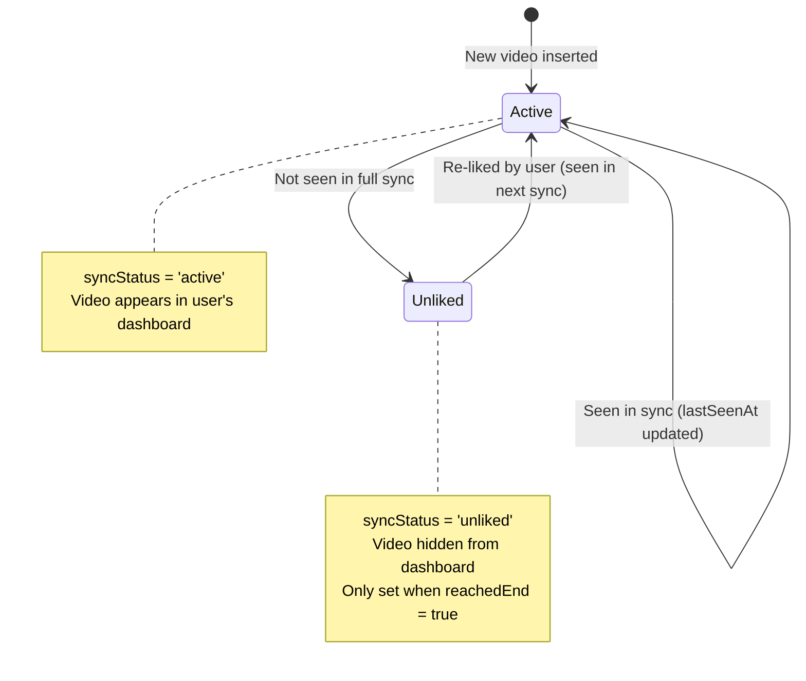
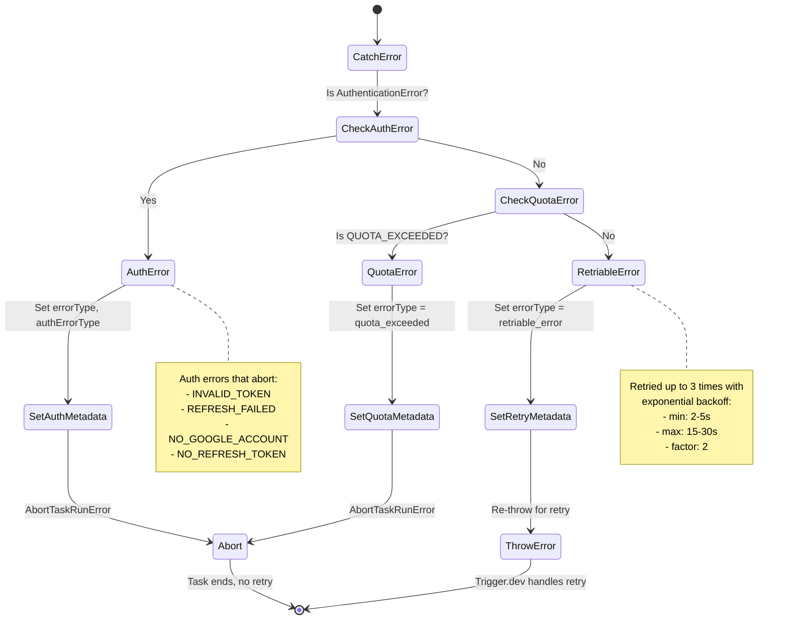

# State Machine Diagrams

This document contains state machine diagrams for the key components in the Ballroom application.

---

## 1. Initial Sync Task (`initialSyncTask`)

Trigger.dev task for the first full sync after onboarding.



---

## 2. Incremental Sync Task (`incrementalSyncTask`)

Trigger.dev task for hourly incremental syncs.



---

## 3. Hourly Sync Schedule (`hourlySyncSchedule`)

Scheduled task that runs every hour and triggers incremental syncs for all onboarded users.



---

## 4. Progressive Sync Algorithm (`progressiveSync`)

Core sync logic used by both initial and incremental syncs.



---

## 5. SyncButton Component State

Client-side state machine for the sync UI controls.



---

## 6. Onboarding Client State

State machine for the onboarding flow.



---

## 7. Dashboard Client State

State machine for the main dashboard view.



---

## 8. Video Sync Status Flow (Database)

State machine for video `syncStatus` field in the database.



---

## 9. Error Handling Flow (Sync Tasks)

Decision tree for handling errors in sync tasks.



---

## Component Interaction Overview

High-level flow showing how components interact:

```mermaid
flowchart TB
    subgraph Client ["Client (Browser)"]
        OB[Onboarding Client]
        DB[Dashboard Client]
        SB[SyncButton]
    end
    
    subgraph API ["API Routes"]
        OBC[/api/onboarding/complete]
        SYNC[/api/youtube/sync]
        FSYNC[/api/youtube/full-sync]
        CAT[/api/categorize]
    end
    
    subgraph Tasks ["Trigger.dev Tasks"]
        IST[initialSyncTask]
        INCT[incrementalSyncTask]
        HSS[hourlySyncSchedule]
    end
    
    subgraph Core ["Core Libraries"]
        PS[progressiveSync]
        QS[quickSync]
        FS[fullSync]
        YT[YouTube API]
        AI[AI Categorize]
    end
    
    subgraph DB ["Database"]
        VIDEOS[(videos)]
        CATS[(categories)]
        USERS[(users)]
    end
    
    OB -->|POST| OBC
    OBC -->|trigger| IST
    
    SB -->|POST| SYNC
    SYNC --> QS
    SYNC --> PS
    
    SB -->|POST| FSYNC
    FSYNC -->|trigger| IST
    
    SB -->|POST| CAT
    CAT --> AI
    
    HSS -->|cron| INCT
    INCT --> QS
    
    IST --> FS
    FS --> PS
    QS --> PS
    
    PS --> YT
    PS --> VIDEOS
    AI --> VIDEOS
    AI --> CATS
    
    DB --> USERS
```
